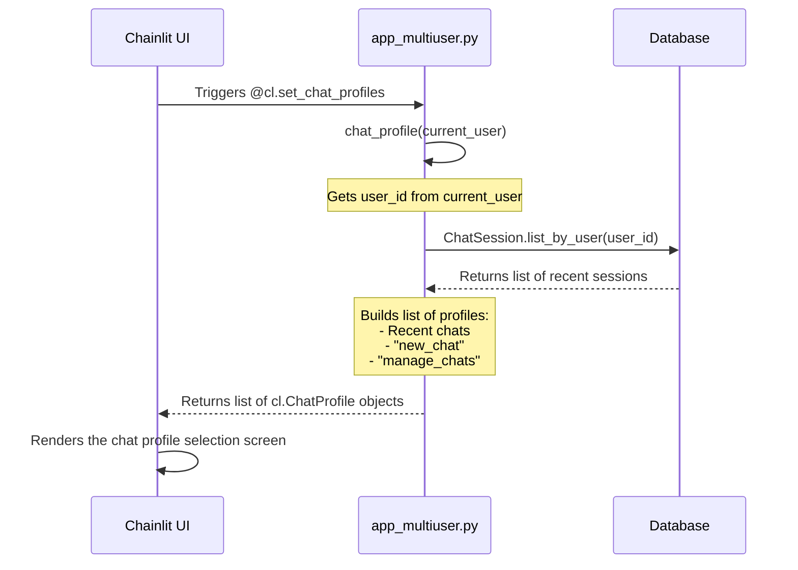
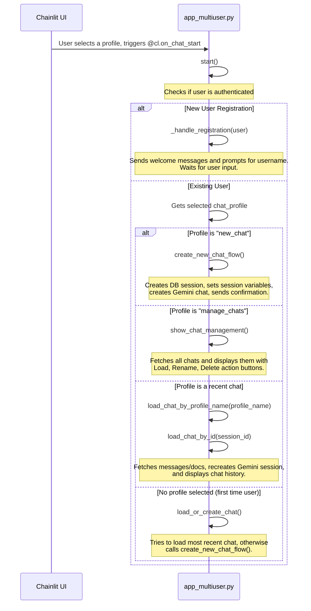
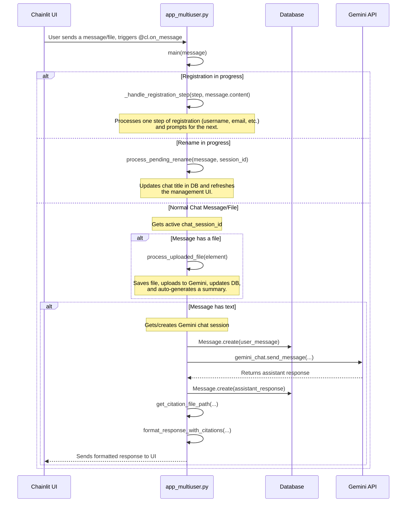
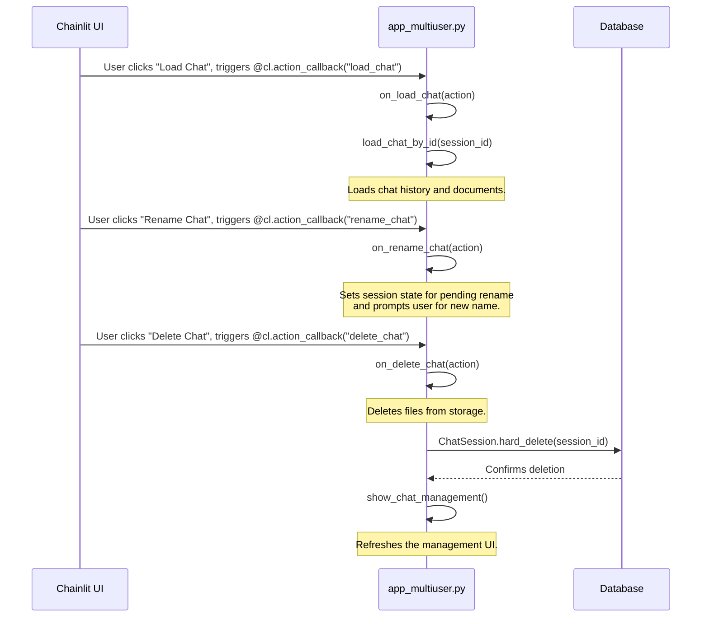

# Application Lifecycle and User Operation Flow for `app_multiuser.py`

This document outlines the function call flow within `app_multiuser.py` when it's run by the Chainlit framework. The application's execution is event-driven, orchestrated by Chainlit decorators like `@cl.on_chat_start`, `@cl.on_message`, and `@cl.action_callback`.

The diagrams below illustrate the sequence of function calls for major user operations.

---

### 1. Initial Load & Chat Profile Selection

When a user first opens the chat, Chainlit prepares the initial screen by asking the application for a list of "chat profiles."

**Flow Description:**

1. **`chat_profile()`**: This function is called by Chainlit to populate the initial "chat profile" selection screen.
2. It fetches the user's recent chat sessions from the database.
3. It then constructs and returns a list of `cl.ChatProfile` objects, which includes recent chats and static options like "New Chat" and "Manage Chats".

---

### 2. Starting a Chat Session

After the user selects a profile from the initial screen, the `@cl.on_chat_start` event is triggered, which calls the `start()` function to route the user to the correct flow.

**Flow Description:**

1. **`start()`**: The main entry point for a chat. It routes the user based on the selected profile.
2. **`_handle_registration()`**: If the user is new (`registration_pending` is true), this function initiates a conversational registration process.
3. **`create_new_chat_flow()`**: Called when the user explicitly selects "New Chat".
4. **`show_chat_management()`**: Displays an interface for managing existing chats.
5. **`load_chat_by_profile_name()` / `load_chat_by_id()`**: These work together to load a past conversation, including its history and any associated documents.

---

### 3. User Sends a Message or File

Once a chat is active, any user input (a text message or a file upload) triggers the `@cl.on_message` event, which calls the `main()` function.

**Flow Description:**

1. **`main(message)`**: The central handler for all incoming user messages. It first checks for special states like registration or renaming.
2. **`_handle_registration_step()`**: A state machine that guides the user through each step of creating an account.
3. **`process_pending_rename()`**: Handles the input for a rename request initiated from the management screen.
4. **`process_uploaded_file()`**: Manages file uploads, including saving the file, processing it with the RAG system, and generating an initial summary.
5. If it's a standard text message, `main()` saves the user's query, sends it to the Gemini model, saves the assistant's response, and formats it for display.

---

### 4. User Interacts with Chat Management Actions

When the user is in the "Manage Chats" view, they can click an action button (Load, Rename, Delete), which triggers a corresponding `@cl.action_callback` function.

**Flow Description:**

1. **`on_load_chat()`**: Triggered by the "Load" button. It calls `load_chat_by_id()` to switch to the selected chat.
2. **`on_rename_chat()`**: Triggered by the "Rename" button. It sets a "pending rename" state, waiting for the user's next message to be the new title.
3. **`on_delete_chat()`**: Triggered by the "Delete" button. It handles the complete removal of a chat session and its associated data, then refreshes the management list by calling `show_chat_management()`.
